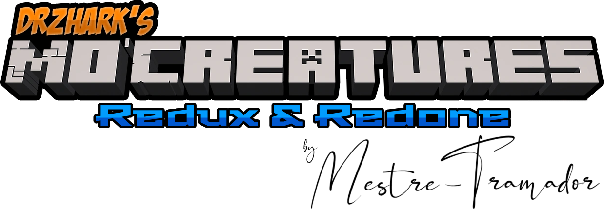

<!-- markdownlint-disable MD033 MD041 -->

  

<!-- **Read it also in: [Español][ES], [Português Brasileiro][PT-BR]** -->

---

  <!-- Badges -->

A total restoration and recreation of DrZhark's original Mo'Creatures mod, remaking
the whole experience of playing it, both solo and with friends.

## The Project

Since near the beginning of 2020 that DrZhark release the source code of his mod
into GitHub under the GNU GPL v3.0, and I, amidst my graduation in 2021 and 2022,
was one of the fellow developers who forked it and tried to continue the work.
I may say, considering not only the pandemics but also a series of misfortunes in
my personal life, that it was not the right time to do such a project...

I stopped working on it, as of my last commit, in January 6th, 2022, and focused
more on my job than any personal idea. Currently I'm still finding it not to be
the right time to execute the aforementioned restoration and recreation, but someday
it will be.

## The Future

I don't know what the future holds and maybe in a even nearer day I'll be working
on this repository again. If you want to play Minecraft with Mo'Creatures right
now in the present, I highly recommend you to check Mo'Creatures Extended [here][extended]
or Mo'Creatures Awakened [here][awakened], both great options!

Although, if you are interested in what I plan to do, check below a list of things
this mod likely would contain:

  

    Show...
  

  <ul>
    <li>
      Change mod loader from Forge to Fabric and also implement the mod using
      mostly Kotlin and/or Scala;
    </li>
    <li>
      Implement an inner division of the mobs into Natural Creatures and
      Fictional Creatures;
    </li>
    <li>
      Recreate the reproduction mechanic with mobs divided into Masculine, Feminine
      and Genderless (for creatures that can't be defined into a gender);
    </li>
    <li>
      Transform the egg "entity" into a block, similar to Minecraft's turtles
      sniffers ones;
    </li>
    <li>
      Divide the actual list of mobs into a more species-driven, for example,
      separating "Pegasus" and "Unicorn" from "Horse";
    </li>
    <li>
      Improve the actual Essences of Undead, Fire, Darkness and Light into
      potions created on the Brewing Stand;
    </li>
    <li>
      Improve the actual Amulets, Scrolls and Staffs to serve more useful purposes
      through all the game;
    </li>
    <li>
      Improve most of the mobs textures and/or models into more accurate with
      current Minecraft versions;
    </li>
    <li>
      Eventually create a new (rare) biome to honor the retro models of mobs
      and their behaviors;
    </li>
    <li>
      Add new mobs, bosses, biome, lore and easter eggs, most of these from old
      Mo'Creatures suggestions thread
      <a
        href="https://www.minecraftforum.net/forums/mapping-and-modding-java-edition/minecraft-mods/mods-discussion/1318069-drzharks-mo-creatures-mod-suggestion-thread"
        target="_blank"
      >
        here
      </a>
      or my own gathered ideas.
    </li>
  </ul>

<!-- [ES]: ./docs/README.ES.md -->
<!-- [PT-BR]: ./docs/README.PT-BR.md -->
[extended]: https://www.curseforge.com/minecraft/mc-mods/mo-creatures-extended
[awakened]: https://www.curseforge.com/minecraft/mc-mods/mocreatures-awakened
